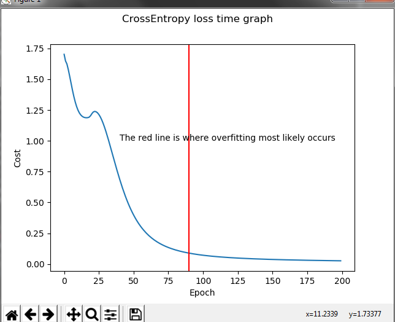

# Iris-Neural-Network-from-Scratch
This is a neural network that categorizes the types of irises from a very famous data set without the help of machine learning libraries.
It uses cross entropy error, and softmax activation.
For the hidden layer, it uses sigmoid. I used stochastic gradient descent, and small number of epochs to indicate where a neural network should stop, and where overfitting may occur

**This graph shows the progression of the neural network**

As you can see, the loss goes down in the way a regular neural network does. The little bump in the graph, where is slightly goes up, and then back down indicates that the neural network has found the global minimum for the error (most likely thanks to the cross entropy error and softmax activation). You can see has the graph has more epochs, the error approaches 0, however, at that point the network has become overfitted, and therefore isn't good for categorizing other pieces of data. I am aware of regularization techniques such as dropout to prevent this from happening.
